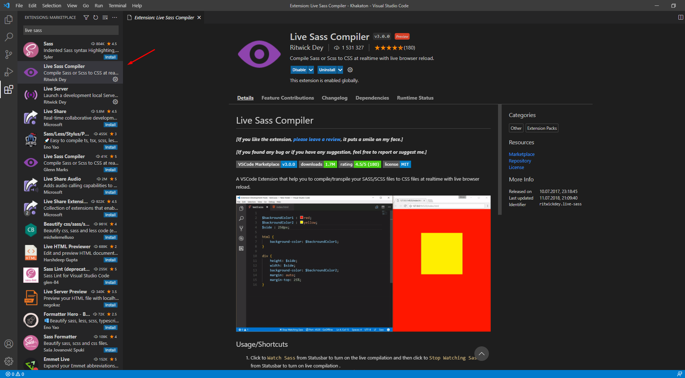
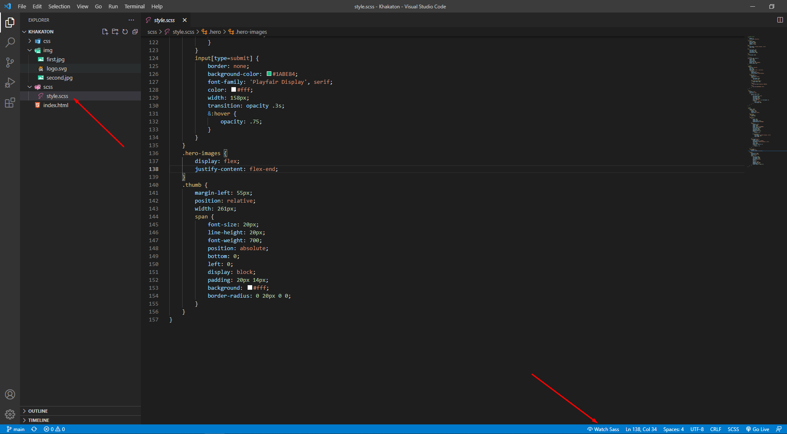
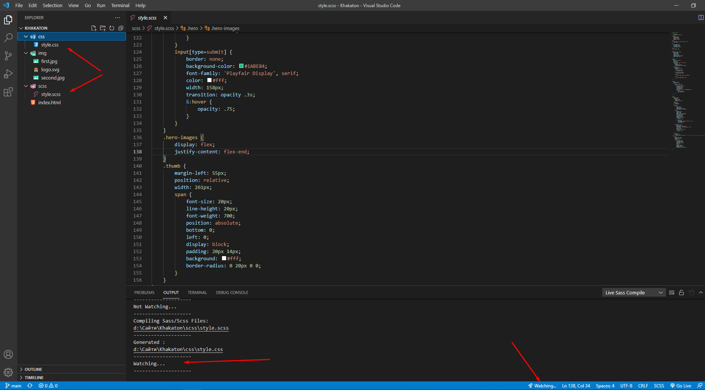
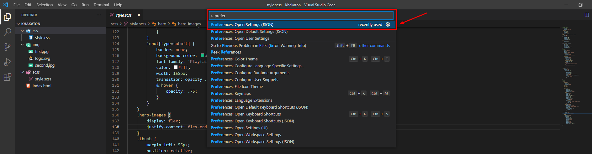
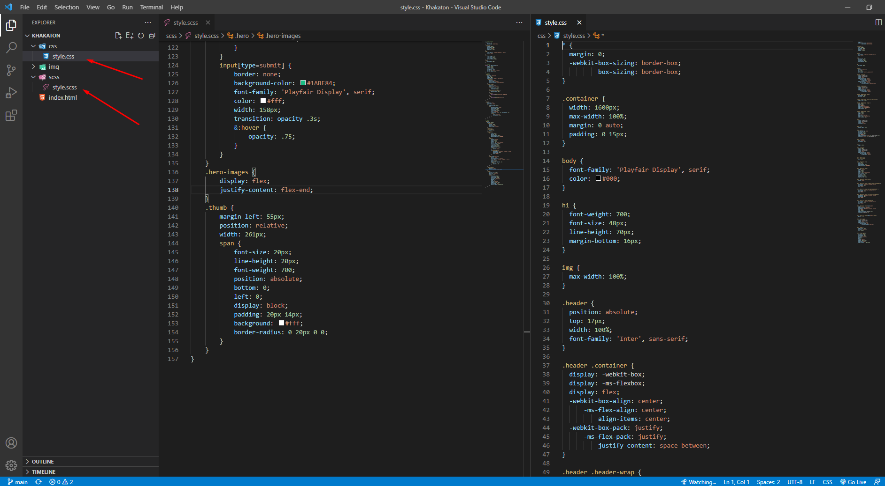

# Урок 29. Препроцесори SASS/SCSS. Підключення до проекту.

### Мета:

* познайомитись із новітніми технологіями написання стилів
* розвивати навички підключення та використання препроцесора у проекті
* виховувати прагнення розвиватись та вивчати нові технології

### І. АОЗ

1. Який формат файлу мають таблиці стилів?
2. Як звернутись до дочірнього елемента?
3. У чому різниця синтаксису псевдокласів та псевдоелементів?

### ІІ. Оголошення теми та мети уроку

Сьогодні ми знайомимось із кардинально новим підходом до створення таблиць стилів. Це нове слово у сфері ІТ.

### ІІІ. Вивчення нового матеріалу

Сучасний CSS - міць, а в комбінації з препроцесорами - взагалі бойова машина для оформлення контенту на веб-сторінках.

Увесь код Sass/SCSS компілюється в CSS, щоб браузери могли його розуміти. На даний момент браузери не підтримують роботу з Sass/SCSS напряму. А стандартна специфікація CSS не надає аналогічного функціоналу.

#### Переваги використання Sass/SCSS:

* вкладеність
* змінні
* покращені математичні операції
* тригонометрія
* міксіни
* функції

#### Змінні

В CSS вони позначаються подвійним тире \(`--`\), а в препроцесорах знаком долара \(`$`\).

```text
$number: 1;
$color: #ff0000;
$text: "tproger forever.";
$text: "IT forever." !default;
$nothing: null;

#container {
  content: $text;
}
```

Змінні в SASS можуть бути застосовані до будь-якої властивості. Частіше всього вони використовуються для властивостей, які повторюються для різних елементів.

#### Вкладені правила

Стандартні вкладені CSS правила пишуться з використанням пропуску.

```text
/* Вкладені правила */
#A {
  color: red;
}
#A #B {
  color: green;
}
#A #B #C p {
  color: blue;
}
```

Ті ж вкладені елементи за допомогою SCSS:

```text
/* Вкладені правила */
#A {
  color: red;
  #B {
    color: green;
    #C p {
      color: blue;
    }
  }
}
```

Як бачите, синтаксис виглядає чистішим і менш повторюваним.

Це особливо корисно при оформленні перевантажених макетів. Таким чином, вирівнювання, в якому вкладені властивості записані в коді, повністю відповідають дійсній структурі макета додатку.

На виході ми отримуємо все той же файл CSS, щоб його зрозумів браузер. Ми лише змінюємо спосіб написання стилів.

#### Амперсанд

В SCSS використовується[ ](https://sass-scss.ru/documentation/sassscript/&_v_sassscript.html)директива &:

```text
#p {
  color: black;
  a {
    font-weight: bold;
    &:hover {
      color: red;
    }
  }
}
```

За допомогою символу `&` ми можемо явно вказати, де має бути встановлено батьківський селектор.

Результат компіляції Sass \(з попереднього прикладу\) в CSS нижче.

```text
#p {color: black;}
#p a {font-weight: bold;}
#p a:hover {color: red;}
```

В результаті амперсанд був скомпільований в назву батьківського елемента `a` \(`a:hover`\).

#### Як налаштувати редактор для роботи з препроцесором SCSS

Один із дієвих і простих способів - встановити у редактор VS Code розширення "Live Sass Compiler"



Після встановлення варто перезавантажити редактор.

Тепер ми можемо створити файл із розширенням .scss. Саме таке розширення мають файли препроцесора. Наприклад, style.scss. Коли такий файл створено, то внизу редактора з'являється кнопка "Watch sass". Необхідно натиснути на неї і наше розширення почне відстежувати зміни в файлі. Після кожного збереження буде заново компілюватись однойменний файл стилів у форматі .css





Без налаштувань, компілятор створить звичайний файл стилів однойменний із файлом препроцесора, а також карту стилів. І все це він збереже в поточній папці. Зазвичай така карта є зайвою. А також зручно зберігати файли різного формату в окремих папках. Тому, пропоную виконати деякі налаштування розширення.

Для цього натискаємо комбінацію клавіш Ctrl + Shift + P і вводимо "Open settings \(Json\)"



Відкриється файл налаштувань, в кінці якого потрібно ввести наступний код:

```text
"liveSassCompile.settings.generateMap": false,    // вимикаємо генерацію карти стилів
"liveSassCompile.settings.formats": [ 
        {
            "format": "expanded",                 // розширений, або стиснутий формат стилів
            "autoprefix": "last 5 versions",      // компілятор буде додавати префікси кросбраузерності для останніх 5 версій відомих браузерів
            "extensionName": ".css",              // розширення вихідного файлу
            "savePath": "css"                     // папка, у яку буде компілюватись файл стилів
        }
    ],
```

Після таких налаштувань ми створюємо окрему папку для файлів препроцесора. Зазвичай її називають `scss`. Після ввімкнення розширення. він скомпілює стилі в папку `css`.



### IV. Застосування знань на практиці

Спробуємо переписати стилі для уже відомого нам макету, використовуючи препроцесор.



### V. Узагальнення нових знань

* Чи сподобався вам новий формат написання стилів? Чим?
* Які переваги препроцесора ви помітили для себе?

### VI. Домашнє завдання

Переписати стилі для наступного проекту: [https://app.schoology.com/attachment/1690243730/source/845739c21f8087eb0f318890c127a4a5.psd](https://app.schoology.com/attachment/1690243730/source/845739c21f8087eb0f318890c127a4a5.psd)

