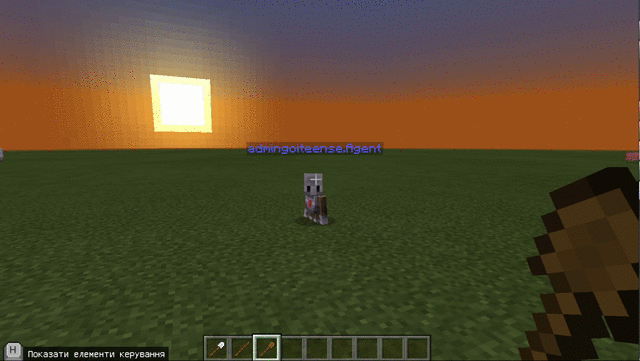
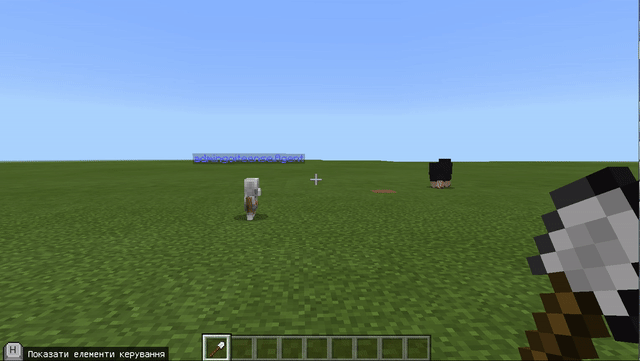
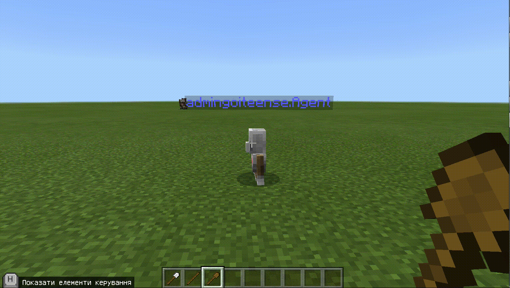

# Урок 01. Знайомство з Minecraft: Education

**Мета уроку:** знайомство студентів і викладача, ознайомлення з робочим середовищем і форматом навчання, вивчення роботи агента за допомогою циклів.

**Завдання уроку:**

1. Познайомити з Викладачем, із середовищем, курсом і підсумковими проектами.&#x20;
2. Ознайомити з сервером, елементами управління гравця, інструментами управління агента.&#x20;
3. Сформулювати зміст навчання (вчимося створювати структури в майнкрафт програмно - це крутіше ніж вручну).
4. Навчити агента створювати лінію (саджанці, квіти).&#x20;
5. Навчити агента створювати прямокутники (квіти).

**Мотивація для студента:**

* ти отримаєш доступ до облікового запису Minecraft і на сервер
* навчишся створювати об'єкти у себе на комп'ютері і на сервері
* зможеш використовувати помічника-агента, який навчає як створювати об'єкти за допомогою коду, а це пеший крок до створення ігор і додатків.

**План уроку:**

1. Представлення викладача (3 хв).&#x20;
2. Знайомство з усіма дітьми (Ім'я, місто, досвід програмування, чому прийшли на курс). (15 хвилин).&#x20;
3. Заходимо в майнкрафт (2 хв).&#x20;
4. Підключаємося на сервер (5 хв).&#x20;
5. Прості дії: телепортуватися до гравці, повернутися ліворуч. (10 хв)&#x20;
6. Дії агента при використанні предмету (залізна лопата (5 хв), палиця (5 хв), дерев'яна лопата(5 хв)&#x20;
7. Створення лінії квітів (15 хв.)&#x20;
8. Зміна елементів в лінії квітів. (5 хв)&#x20;
9. Збільшення кількості елементів в лінії квітів (5 хв)&#x20;
10. Комбінація лінії квітів та поворотів (5 хв)&#x20;
11. Створення квадрату (5 хв)&#x20;
12. Підбиття підсумків (5 хв)&#x20;
13. Показуємо що вміємо (будуємо будинок, грядку).

## Прості дії

Заходимо в редактор коду. (Нажимаємо клавішу **с**). Обираємо блок "Новий проект".

Пишемо назву проекту **"Lesson 1"**

Беремо пункт меню "Агент" (1). Перетягуємо блок "агент - телепортуватися до гравця".(2) В блоку _При команді чату "run"_. Заміняємо команду "**run**" на команду "**t**" (3). Запускаємо(4).\
Запустимо чат (клавіша "**t**"). Введемо команд **t**(1). Запустимо код (2).

Побачимо результат (агент телепортувався до гравця). Щоб побачити агента відійдіть назад (клавіша "**s**").

В пункті меню "Гравець"(1). _Візьмемо блок "При команді чату jump"_ і переносимо його на вільне поле (2). В блоку _При команді чату "run"_. Заміняємо команду "**run**" на команду "**l**".

Зайдемо в пункт меню **"Агент"** (1), візьмемо блок "Повернутися ліворуч" та перетягнемо його до блоку "При команді чату l"(2). Запустимо код.

Відкриємо чат (клавіша **t** на клавіатурі) та введемо команду "l".

Побачимо результат - агент повернувся ліворуч

## Дії агента при використанні предмету (використання Залізної лопати рушить агента вперед).

В Пункті меню "Гравець" беремо блок _"До предмету, що використовується"_ та перетягнемо його на вільне поле.

В пункті меню "Агент" (1). Візьмемо блок "Агент - переміститися вперед by 1" та перемістимо його в синій блок _"До предмету, що використовується"_ (2) та запустимо код в роботу (3)\
**Візьмемо залізну лопату.** Для цього зайдемо в меню інвентар (клавіша "**e**"). Оберемо блок "мечі та лати"(1), натиснемо на пункт "Лопати" та перетягнемо _залізну лопату_ в комірку(3) та закриваємо блок інвентарю (4).

Для використання лопати натисніть праву клавішу миші.

## Запускати дії агента при використанні предмету (палиця)

В пункті меню "Гравець" візьміть блок "До предмет, що використовується" та поставимо його на вільне місце на робочому полі.

Заміняємо предмет, що використовується (1) на палицю (2).

Дамо блок агенту, який він буде використовувати. Для цього переходимо в пункт меню "Агент"(1) та пролістаємо вниз (2)

Беремо блок _"agent, постав блок або предмет кількість 1 у слот 1"_ та перенесемо його до синього блоку (крокодильчика) _"до предмет, що використовується"_

Заміняємо блок із травою (що за замовчуванням) (1) на блок дошок з дубової деревини.

В пункті меню "Агент" візьміть блок _"агент - розмістити вперед"_ та перетягніть його до синього блоку (крокодильчику) _"до предмет (палиця), що використовується"_ під блоком _"agent, постав блок або предмет кількість 1 у слот 1"_ (1). Запустіть код (2).

**Візьмемо палицю**: Зайдемо в інвентар (клавіша **e** на клавіатурі). Та додаємо до комірки 2 палицю.

Візьмемо до рук гравця палицю (натиснемо клавішу **2** на клавіатурі).

Використаємо палицю (права клавіша миші на клавіатурі).

## Запускати дії агента при використанні предмету (дерев'яна лопата)

В меню _"Гравець"_ візьмемо блок _"до предмет, що використовується"_ та переносимо його на вільне місце робочого поля.

Заміняємо предмет на _дерев'яну лопату_

Дамо блок агенту, який він буде використовувати. Для цього переходимо в пункт меню "Агент"(1) та листаємо вниз (2)

Беремо блок _"agent, постав блок або предмет кількість 1 у слот 1"_ та перенесемо його до синього блоку (крокодильчика) _"до предмет, що використовується"_

Заміняємо блок трави (1) на білий тюльпан (2)

В меню Агент (1) беремо блок _"Агент - розмістити вперед"_ та перетягуємо його в блок _"до предмет, що використовується"_ (2)

В блоці _"Агент розмістити вперед"_ змінюємо **вперед** на **вниз**. Та запускаємо код.

Додаємо до комірки **3** гравця дерев'яну лопату. Для цього заходимо в інвентар (клавіша **e** на клавіатурі). Заходимо в групу _"Мечі та лати"_(1) обираємо групу _"Лопати"_ (2) ставимо дерев'яну лопату до комірки 3 (3). За закриваємо вікно інвентарю (4).

Беремо в руки гравця дерев'яну лопату. Для цього нажимаємо цифру **3** на клавіатурі.

Використаємо палицю (натискаємо праву клавішу миші).

## Створення лінії квітів

Для цього в редакторі коду (клавіша **c** на клавіатурі). В меню _"Агент"_ візьмемо блок _"Переміститися вперед by 1"_ та перетягнемо в блок, що об'єднує дії, які виконуються при використанні палиці (синій крокодильчик).

В пункті меню _"Цикли"_ візьмемо блок _"Повторити 4 рази"_ (4-й зверху). Та "з'їмо" їм блоки "Розмістити вниз" та "Переміститися вперед". Та запустимо код.

Використаємо дерев'яну лопату

## Зміна елементів в лінії квітів

Отримаємо 4 білих тюльпана, посаджених в ряд.

Заміняємо білі тюльпані на помаранчеві.

Використаємо дерев'яну лопату знову. Отримаємо ще 4 помаранчевих тюльпана, посаджених в ряд.

## Збільшення кількості елементів в лінії квітів

Заміняємо цифру **4** в блоці "Повторити" на **10**.

Використаємо дерев'яну лопату і побачимо 10 помаранчевих тюльпанів в ряд.

## Комбінація лінії квітів та поворотів

Ви можете використовувати разом декілька інструментів для того, щоб віддавати команди агенту. Це можем бути комбінація використання предмету та команди чату. Наприклад, для того, щоб створити квадрат з квітів ми можемо використати **дерев'яну лопату** (для того, щоб створити сторону квадрату) та команду чату **l** для того, щоб повернути ліворуч. Якщо по повторюємо **4 рази**: створення лінії з 10 квітів та поворот ліворуч, то отримаємо квадрат:

## Створення квадрату

В пункті меню _"Цикли"_ візьмемо блок _"Повторити 4 рази"_. Та "з'їмо" їи існуючий цикл із 10 повторювань.

В пункті меню _"Агент"_ візьмемо блок _"Повернути ліворуч"_, та поставимо його між 2 зеленими "крокодильчиками" (повторити 4 рази та повторити 10 разів.)

Виконання такого коду будує квадарт зі стороною 11 (10+1).

**Кахут:**


