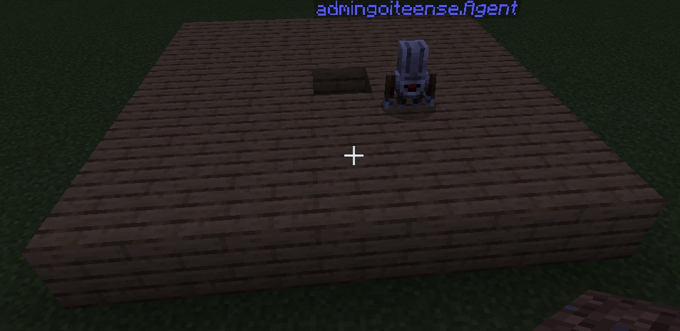

# Урок 19. Вкладені квадрати

## 0. Описание занятия

В первой части занятия студенты овладеют навыком использования вложенных циклов: а. создания квадарта из блоков и цветов; б. создания полисадников (квадарт полностью заполненный цветами) и площадок из блоков; в. создания пирамиды (на примере маяка). Во второй части занятияв студенты овладевают навыком использования переменных (передачи параметра при команде чата), а также создания вложенных циклов

## 1. Создание квадрата последовательными циклами

Переход к вложенному циклу осуществляется через создание квадрата 4-мя последовательными линейными циклами:

### Берем - созданную линию

.jpg>)

### Добавляем букву s к команде чата

.jpg>)

### ДублируеУрокм блок повторения размещения блока 4 раза

.jpg>)

.jpg>)

### Между каждым блоком цикла ставим блок "Повернуться налево"

.jpg>)

### Получаем результат

.jpg>)

## 2. Создание квадрата вложенными циклами

### Дублируем квадрат из 4-х циклов (команда lines)

.jpg>)

### Меняем команду с lines на q

.jpg>)

### Показываем, что предыдущий алгоритм цикличный (повторяющийся)

.jpg>)

### Убираем и удаляем блоки, которые повторяются

.jpg>)

.jpg>)

### Берем блок "Повторить 4 раза" и оборачиваем им повторяемую часть

.jpg>)

### Получаем квадрат

.jpg>)

[Задания 1 и 2](https://makecode.com/\_AgviCpRy52pP)

## 3. Создание вложенных квадратов

### Дублируем блок q

.jpg>)

### Меняем команду чата на inq

.jpg>)

### Дублируем блок повторения

.jpg>)

### Добавляем блоки "переместиться вперед, переместиться влево", меняем кол-во повторений с 5 на 3

.jpg>)

### Еще раз добавляем блоки "переместиться вперед, переместиться влево"

.jpg>)

### Еще раз добавляем блок повторения

.jpg>)

### Меняем кол-во повторений с 3 на 1.

.jpg>)

### Получаем результат

.jpg>)



## 4. Создание пирамиды

\

.jpg>)

.jpg>)



## 5. Линия заданной длинны

Удобно, когда мы можем из чата создать линию такой длины, которая нам необходима.&#x20;

.jpg>)

.jpg>)

.jpg>)

.jpg>)

.jpg>)

.jpg>)

.jpg>)

.jpg>)

_Задания:_\
1\. Посадите _n_ тюльпанов по команде _tulips_. 2. Поставьте в ряд _n_ булыжников по команде _stone_ 3. Сделайте заготовку для дороги (выкопайте _n_ ямок и поставьте в них _n_ булыжника). Выполните по команде _road_. _n_ - получите при вводе команды как параметр.

## 6. Прямоугольник c параметрами

Задайте размер прямоугольника с помощью параметра.\

.jpg>)

.jpg>)

.jpg>)

.jpg>)

.jpg>)

.jpg>)

**Задания.**\
Выполните задания с использованием передаваемого параметра. 1. Огородите свою территорию, создав квадрат из булыжника размером 50х50. 2. Создайте квадрат 5х5 из деревянных блоков и наполните его водой (вручную). 3. С помощью команд, после которой агент создает квадрат создайте полностью заполненный квадрат (набор вложенных квадратов с командами 6, 4, 2).&#x20;

