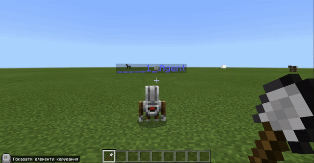
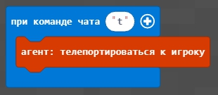
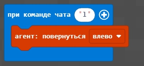
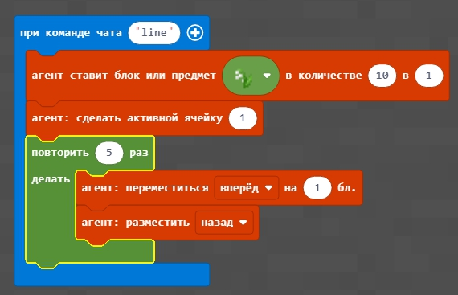
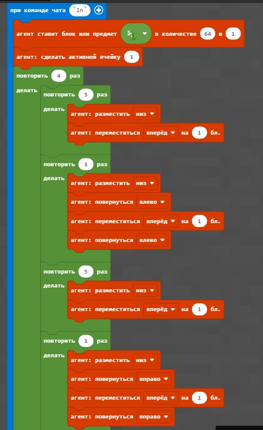

# Урок 2. Сад

### Мета заняття:

## Повторення.

[Кахут на розуміння орієнтції в грі](https://create.kahoot.it/share/minecraft-2/2319195d-9fee-4d6d-9516-7c368a8b89f8)

[Кахут. Прості команди на будівництво](https://create.kahoot.it/share/minecraft-4/ece3aef7-a443-485b-85ab-783d1ca76e20%20)

## Відмінність блоків від квітів.

Блоки відрізняються від квітів тим, що агент не може поставити блок в ту саму клітинку, в якій знаходиться сам.

## Поставити блок "вниз".

Додамо команду, яка підіймає агента на 1 блок вгору \(над землею\).  Тепер місце під агентом є вільним і в нього можна поставити певний блок \(наприклад блок дошок\). 

Реализуем с помощью данной технологии квадрат из блоков. 

## Создадим бассейн

Для этого - возьмем ведро с водой и зальем водой созданный прямоугольник из блоков

## 1. Базовые команды

Для того, чтобы поставить агента в нужную точку и опеределить ему требуемое направление используются соответствующие команды:

**Телепорт:**  

**Поворот \(налево\):**  

## 2. Грядка

Для того, чтобы посадить грядку - передадим агенту нужные цветы, активируем ячейку, в которой лежат цветы и в цикле - посадим 5 цветков.

## 3. Клумба

Для того, чтобы посадить клумбу - добавим переходы между грядками.

## 4. Углубление под клумбу

Для того, чтобы наши цветы защитить от ветров. Сделаем для них углубление.  
Для этого - опустим агента на 1 блок вниз \(агент "выроет яму\).

Далее - используем цикл, аналогичный тому, который нам помогал садить цветы. Но теперь мы не садим цветы, а снимаем слой земли \(уничтожаем блоки земли\).

После того, как земля выкопана - вернемся в точу, из котором мы начинали капать. Для того, чтобы посадить цветы.  

После этого - высадим цветы \(команда **ln**\)

## Дополнительное задание.

1. Поменять размеры цветника - сделать его в 2 раза меньше, в 1,5 раза больше.
2. Посадить другие цветы.
3. Оформить цветник по желанию.
4. Посадить цветы по периметру квадрата.
5. Построить цветник на возвышении, а не на углублении.

## Ограждение

Для того, чтобы в общем мире очерчивать территорию, в которой будет студент создавать свои элементы используем создание квадрата 40х40.  

## Домашнее задание.

1. Огородить территорию дубовыми досками 50х50
2. Перед территорией поставить табличку и подписать ваше владение.
3. На территории построить кодом: а. бассейн. б. Цветник 10х10 \(из тюльпанов или других цветов на ваш выбор\).  

   4\*. Построить фундамент дома \(бетонный квадрат минимум 10х10\).  

   5\*\*. Построить дом на территории \(на фундаменте\) в котором должен быть цветник \(возле дома\), подвал, а также внутреннее оснащение \(максимально используйте код.\)  

