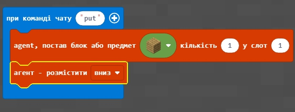
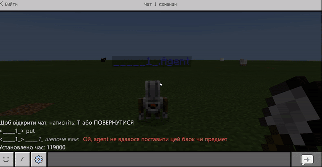
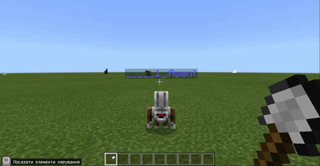
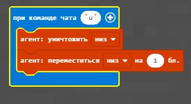
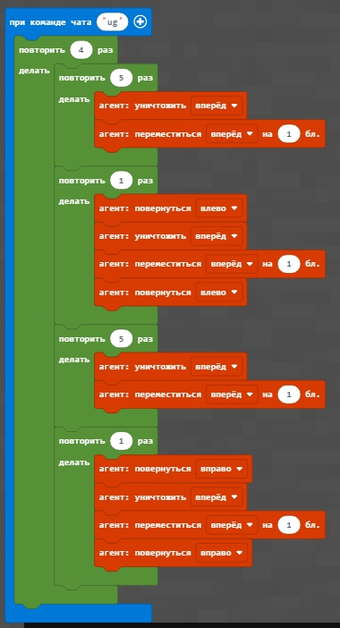
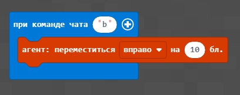

# Урок 2. Сад

### Мета заняття:

## Повторення.
<a href = "https://create.kahoot.it/share/minecraft-2/2319195d-9fee-4d6d-9516-7c368a8b89f8">Кахут на розуміння орієнтції в грі</a>
 

<a href = "https://create.kahoot.it/share/minecraft-4/ece3aef7-a443-485b-85ab-783d1ca76e20 ">Кахут. Прості команди на будівництво</a>

## Відмінність блоків від квітів.
Блоки відрізняються від квітів тим, що агент не може поставити блок в ту саму клітинку, в якій знаходиться сам.

## Поставити блок "вниз".

Додамо команду, яка підіймає агента на 1 блок вгору (над землею). 

 Тепер місце під агентом є вільним і в нього можна поставити певний блок (наприклад блок дошок).
 

 

Реализуем с помощью данной технологии квадрат из блоков. 
 

  

   

## Создадим бассейн
Для этого - возьмем ведро с водой и зальем водой созданный прямоугольник из блоков

  

  

   

## 1. Базовые команды
Для того, чтобы поставить агента в нужную точку и опеределить ему требуемое направление используются соответствующие команды:  

**Телепорт:**  
  

**Поворот (налево):**  
  

## 2. Грядка
Для того, чтобы посадить грядку - передадим агенту нужные цветы, активируем ячейку, в которой лежат цветы и в цикле - посадим 5 цветков.  

  

## 3. Клумба
Для того, чтобы посадить клумбу - добавим переходы между грядками.  
  
    

## 4. Углубление под клумбу
Для того, чтобы наши цветы защитить от ветров. Сделаем для них углубление.  
Для этого - опустим агента на 1 блок вниз (агент "выроет яму).

  

Далее - используем цикл, аналогичный тому, который нам помогал садить цветы. Но теперь мы не садим цветы, а снимаем слой земли (уничтожаем блоки земли).  
  
  

После того, как земля выкопана - вернемся в точу, из котором мы начинали капать. Для того, чтобы посадить цветы.  
  

После этого - высадим цветы (команда **ln**)

## Дополнительное задание.
1. Поменять размеры цветника - сделать его в 2 раза меньше, в 1,5 раза больше.
2. Посадить другие цветы.
3. Оформить цветник по желанию.
4. Посадить цветы по периметру квадрата.
5. Построить цветник на возвышении, а не на углублении.

## Ограждение 
Для того, чтобы в общем мире очерчивать территорию, в которой будет студент создавать свои элементы используем создание квадрата 40х40.  

## Домашнее задание.
1. Огородить территорию дубовыми досками 50х50
2. Перед территорией поставить табличку и подписать ваше владение.
3. На территории построить кодом: а. бассейн. б. Цветник 10х10 (из тюльпанов или других цветов на ваш выбор).  
4*. Построить фундамент дома (бетонный квадрат минимум 10х10).  
5**. Построить дом на территории (на фундаменте) в котором должен быть цветник (возле дома), подвал, а также внутреннее оснащение (максимально используйте код.)  
