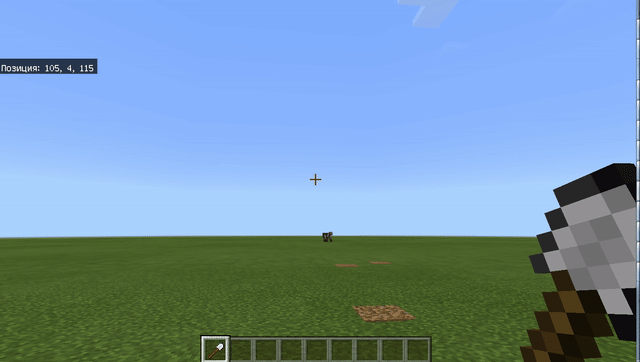
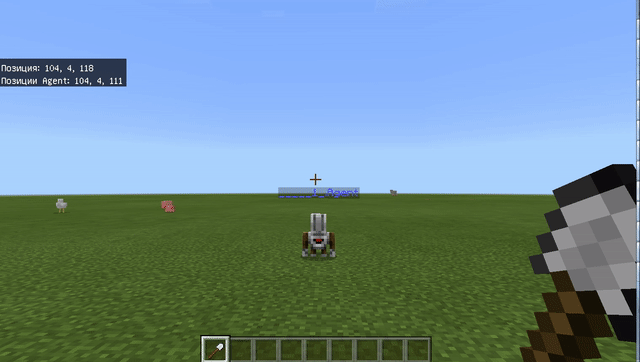

# Урок 10. Побудова і внутрішня частина

### Куб \(параллелепипед\)

В Minecraft с помощью команды "Блоки" мы можем создавать различные формы практически из любого материала. Для этого - необходимо определить **2** крайние точки. Это можно делать, поставив в одну точку агента, а во второую приведя игрока либо же это сделать благодаря рассчетам.

В примере выше мы строим куб **10х10х10** из деревянных досок, используя для этого координаты. Основание нашего куба лежит на уровне `y=4` и идет из точки `x=100,z=100` в точку `x=110,z=110`, в высотой - равной 10 блоков \(до точки `y=14`\)  
[Код на JavaScript](https://github.com/mikh-maksi/minecraft-code/blob/main/builds/01simple_cube.js)

Запустим соответствующий код.

Проверим полученное строение: внутри оно заполнено деревянными блоками

### Внутренняя полость

Использовать куб, который внутри полностью заполнен для, например, создания дома - очень неудобно. Поэтому реализуем создание внутренней полости: воздух будет внутри нашего куба, отступая от верхней и боковых границ по одному блоку и касаясь нижнего края земли. Для этого из всех координат точек, которые использовались нами для создания деревянного куба вычтем по **1**.

Запустим данный код и получим готовый остов здания, полый внутри.

[Код на JavaScript](https://github.com/mikh-maksi/minecraft-code/blob/main/builds/02simple_cube_air.js)

### Вход

Здание без входа — также достаточно сложно использовать, либо прийдется пробивать проход вручную. Реализуем место для входа с помощью кода: для этого станем в точке, в которой мы хотим делать отверстие кодом и зафиксируем его координаты. В примере — это стена из `x=100` в `x=110`. Отверстие создадим как блок воздуха между точками `105,5,110` и `104,4,110`. 

Запустим соответствующий код

[Код на JavaScript](https://github.com/mikh-maksi/minecraft-code/blob/main/builds/03simple_cube_for_doors.js)

### Установка двери.

Агенту можно программно добавлять в ячейки инвентаря вещества \(доски, кирпичи, т.д.\). Для того, чтобы добавить предмет в ячейку его нужно взять в ячейку игрока и передать её в ячейку агента \(нажав на него правой клавишей\). **Заходим в инвентарь. Выбираем дверь.**

**Нажимаем правой клавишей на агента**

**Переносим из инвентаря игрока в инвентарь агента**

Когда в ячейке 1 инвентаря агента есть двери - он их может разместить перед собой. Для этого телепортируем агента пере дверным проемом `(105,4,111)` лицом на север \(в сторону уменьшения z\). Разместим вперед \(дверь\), переместимся влево и еще раз разместим дверь.

Код размещения в увеличенном виде:

### Этажи

Внутри высокого здания необходимо размещать различные элементы. Это удобно делать по этажам. Для этого - создадим этажи: плоскости от точки `x=100,z=100` в точку `x=110,z=110` на уровне **3**\(пол\), **7**\(1-й этаж\), **11**\(2-й этаж\), **15**\(крыша\). Для этого используем цикл с параметром и формулу \(**3**+`index`**\*4**\), где `index` изменяется от **0** до **3-х** соответственно. Если не делать крышу - то можно изменения `index` - проводить от **0** до **2**.

**Запустим и проверим наличие перекрытий**

### Окна

Хорошо, когда в доме есть окна. Их также можно создать с помощью кода. для этого определим их положение \(в соответствии с координатой **102** на уровне `5,6` - 1-й этаж, `9,10` - 2-й этаж, `13,14` - 3-й этаж\)

**Запустим общий код**

### Корректировки

Но так, как наш дом является сбором добавлений: сначала мы сделали куб, потом дверной проем с дверьми, потом этажи, потом окна. Получилось так, что в исходной высоте - 10 не помещаются 3 этажа: высотра 3-го этажа получается 2 блока и это хорошо видно при взгляде на оконо 3-го этажа.

Т.е. нам необходимо увеличить высоту здания, чтобы помещалось 3 этажа: 3 этажа по 3 блока + 2 перекрытия \(между 1-м и 2-м и между 2-м и 3-м этажами\). 

Также - у нас есть особенность, что при постановке этажей - первое перекрытие - это пол. В первый ряд окон находится под землей. 

Под корректируем это - уменьшив количество итераций цикла \(счетчик изменится от 0 до 2\) и подкорректируя аргумент суммы.

В итоге - получим правильный 3-й этаж:

[Код на JavaScript](https://github.com/mikh-maksi/minecraft-code/blob/main/builds/06simple_cube_for_doors_doors_flours_window_fix.js)

