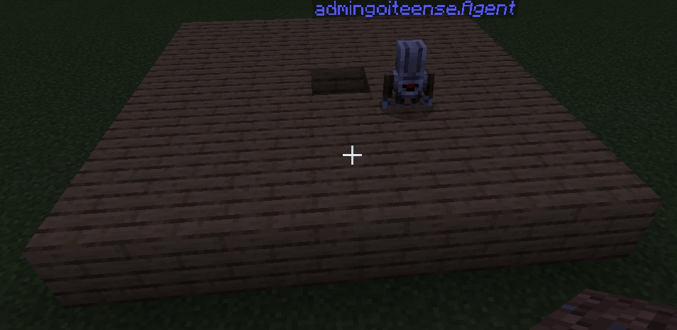

# Занятие 3. Вложенные квадраты
## 0. Описание занятия
В первой части занятия студенты овладеют навыком использования вложенных циклов: а. создания квадарта из блоков и цветов; б. создания полисадников (квадарт полностью заполненный цветами) и площадок из блоков; в. создания пирамиды (на примере маяка).
Во второй части занятияв студенты овладевают навыком использования переменных (передачи параметра при команде чата), а также создания вложенных циклов
## 1. Создание квадрата последовательными циклами
Переход к вложенному циклу осуществляется через создание квадрата 4-мя последовательными линейными циклами:
#### Берем - созданную линию
  

#### Добавляем букву s к команде чата
  

#### Дублируем блок повторения размещения блока 4 раза

  
  

#### Между каждым блоком цикла ставим блок "Повернуться налево"

  

#### Получаем результат
  

## 2. Создание квадрата вложенными циклами
#### Дублируем квадрат из 4-х циклов (команда lines)
  

#### Меняем команду с lines на q
  

#### Показываем, что предыдущий алгоритм цикличный (повторяющийся)
  

#### Убираем и удаляем блоки, которые повторяются
  
  

#### Берем блок "Повторить 4 раза" и оборачиваем им повторяемую часть
  

#### Получаем квадрат
  

<a href = "https://makecode.com/_AgviCpRy52pP">Задания 1 и 2</a>

## 3. Создание вложенных квадратов
#### Дублируем блок q 
  

#### Меняем команду чата на inq 
  

#### Дублируем блок повторения 
  

#### Добавляем блоки "переместиться вперед, переместиться влево", меняем кол-во повторений с 5 на 3
  

#### Еще раз добавляем блоки "переместиться вперед, переместиться влево"
  

#### Еще раз добавляем блок повторения
  

#### Меняем кол-во повторений с 3 на 1.
  

#### Получаем результат
  

<a href = "https://makecode.com/_dkchPyFo80pH">https://makecode.com/_dkchPyFo80pH</a>

## 4. Создание пирамиды

  
  

<a href = "https://makecode.com/_AeLi9wEtkMbX">https://makecode.com/_AeLi9wEtkMbX</a>

## 5. Линия заданной длинны
Удобно, когда мы можем из чата создать линию такой длины, которая нам необходима.
  
  
  
  
  
  
  
  
  

*Задания:*  
1. Посадите *n* тюльпанов по команде *tulips*. 
2. Поставьте в ряд *n* булыжников по команде *stone*
3. Сделайте заготовку для дороги (выкопайте *n* ямок и поставьте в них *n* булыжника). Выполните по команде *road*.
*n* - получите при вводе команды как параметр.
## 6. Прямоугольник c параметрами
Задайте размер прямоугольника с помощью параметра.  
  
  
  
  
  
  

**Задания.**  
Выполните задания с использованием передаваемого параметра.
1. Огородите свою территорию, создав квадрат из булыжника размером 50х50.
2. Создайте квадрат 5х5 из деревянных блоков и наполните его водой (вручную).
3. С помощью команд, после которой агент создает квадрат создайте полностью заполненный квадрат (набор вложенных квадратов с командами 6, 4, 2).
