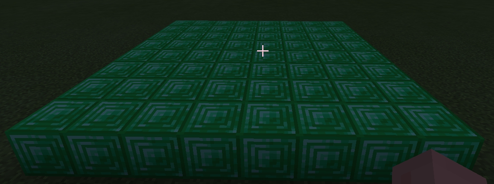
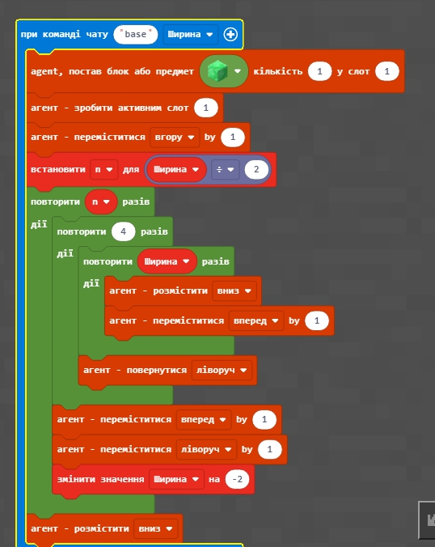
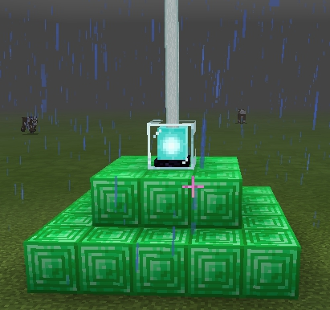
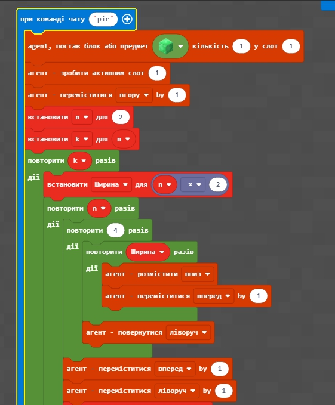
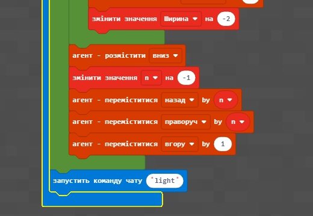
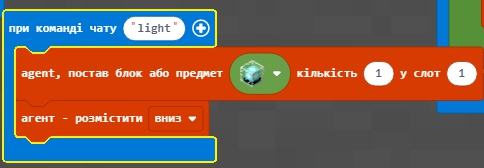

# Урок 4. Піраміда

## Квадрат

[Код](https://github.com/mikh-maksi/minecraft-code/blob/main/s.js)

## Основа

[Код](https://github.com/mikh-maksi/minecraft-code/blob/main/base.js)

## Пирамида

[Код](https://github.com/mikh-maksi/minecraft-code/blob/main/pir.js)

