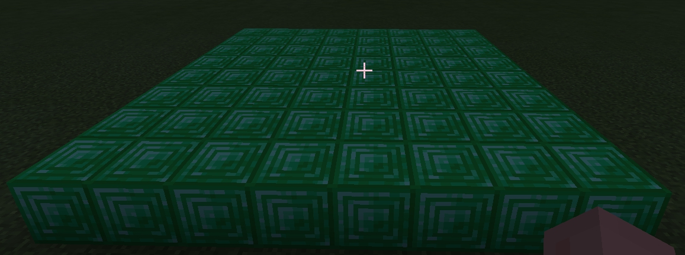
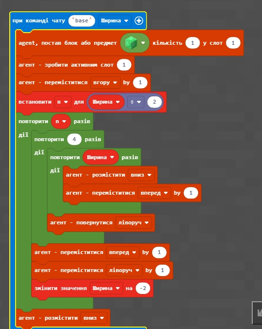
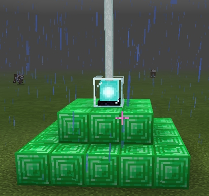
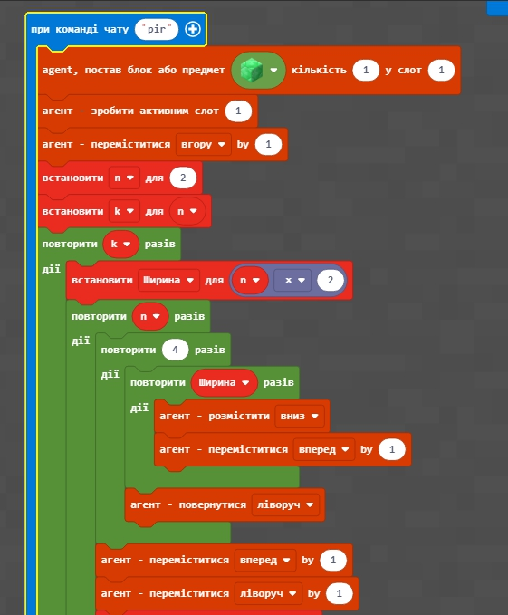
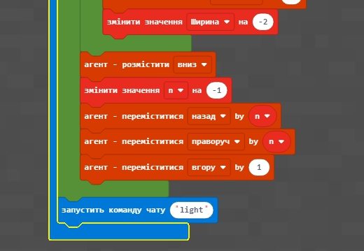
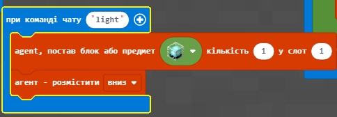

# Урок 4. Піраміда

## Квадрат

  

<a href = "https://github.com/mikh-maksi/minecraft-code/blob/main/s.js">Код</a>

## Основа

  

<a href = "https://github.com/mikh-maksi/minecraft-code/blob/main/base.js">Код</a>

## Пирамида

<a href = "https://github.com/mikh-maksi/minecraft-code/blob/main/pir.js">Код</a>
 

