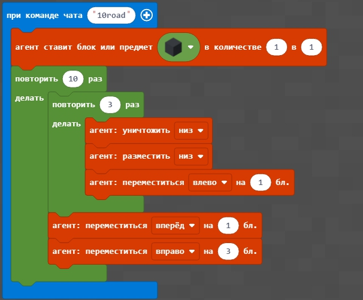
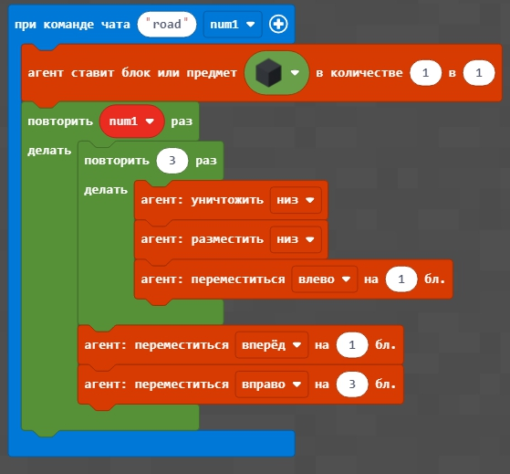
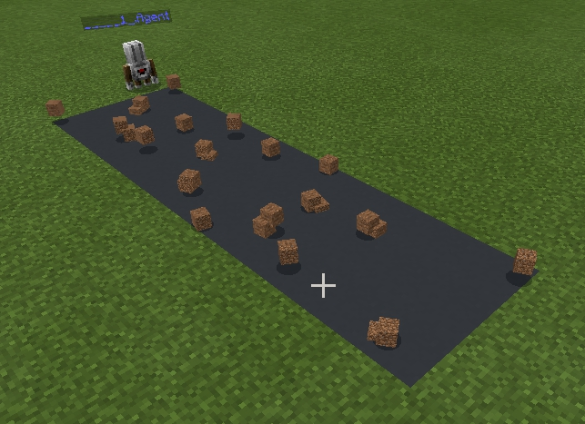

# Урок 5. Дорога. Цикл з параметром

### 1. Цикл с параметром.

Мы можем использовать не только цикл, который повторяет несколько раз одинаковые действия, но и цикл, который изменяет параметр с каждым шагом. Такой цикл называется циклом с параметром.   
  
  
  
  
  
  
  
  
  

### 2. Дорога

Делаем программу, которая строит дорогу шириной 3 блока и длинной 10 блоков.  
  
[Код дороги на 10 блоков](https://github.com/mikh-maksi/minecraft-code/blob/main/10road.js)  
В результате - получим соответствующую дорогу, на которой лежат блоки с землей.   
Делаем дорогу, шириной 3 блока и длиной, которая соответствует введенной 

[Код дороги на n блоков, которые получают из чата.](https://github.com/mikh-maksi/minecraft-code/blob/main/10road.js)

В результате - получим соответствующую дорогу, на которой лежат блоки с землей.  

