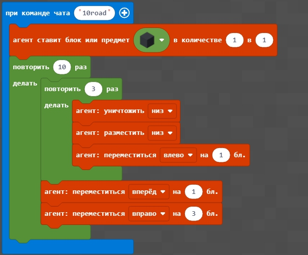
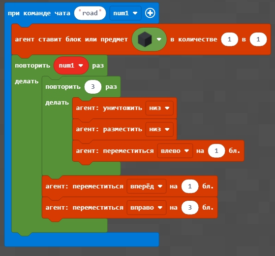

# Урок 5. Дорога. Цикл з параметром

# Цикл с параметром
## 1. Цикл с параметром.
Мы можем использовать не только цикл, который повторяет несколько раз одинаковые действия, но и цикл, который изменяет параметр с каждым шагом. Такой цикл называется циклом с параметром.
  
  
  
  
  
  
  
  
  
  
  

## 2. Дорога
Делаем программу, которая строит дорогу шириной 3 блока и длинной 10 блоков.  
  
<a href = "https://github.com/mikh-maksi/minecraft-code/blob/main/10road.js" target = "_blank">Код дороги на 10 блоков</a>  
В результате - получим соответствующую дорогу, на которой лежат блоки с землей.
  
Делаем дорогу, шириной 3 блока и длиной, которая соответствует введенной
  

<a href = "https://github.com/mikh-maksi/minecraft-code/blob/main/10road.js" target = "_blank">Код дороги на n блоков, которые получают из чата.</a>  

В результате - получим соответствующую дорогу, на которой лежат блоки с землей.  
  