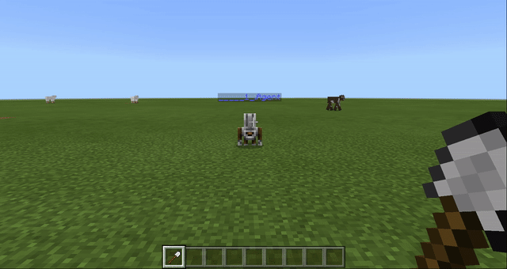
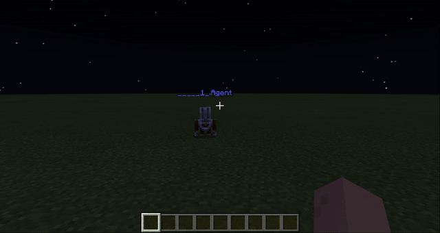
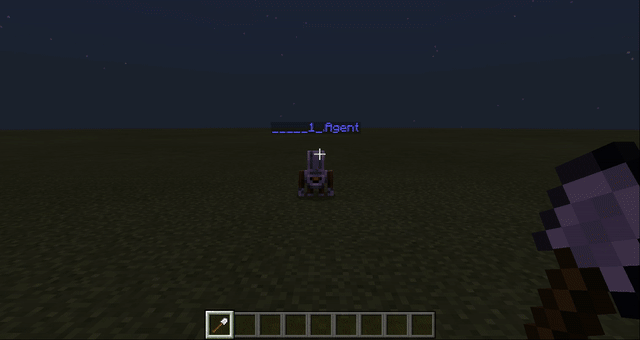

# Урок 6. Ліхтарі вздовж дороги

## Строим фонарь.
Для начала - строим фонарь вручную для того, чтобы студенты увидели структур будущей конструкции.
Для этого - возьмем в инвентаре забор и светокамень.
Выберите один из заборов:  

Например, возьмите забор из дуба:  
  

Выберите место, в котором будем строить:  
 

Построим фонарь (ножка высотой 4, перекладина &mdash; 2)
 

Берем светокамень в инвентарь.
 

Подвешиваем светокамень на край перекладины  

Программируем фонарь с помощью кода:

Программируем фонарь с помощью кода:  

Добавляем переход между фонарями:  

Последовательно - напишите команды light, transitions, light.

Напишите программу, которая объединяет постройку фонаря (light) и переход (transition). При этом - добавьте возможность повторять создание словаря и переход несколько раз так, чтобы параметр передавался непосредственно в команде.

Запустите команду lights с параметром 5 (`lights 5`), чтобы было создано 5 фонарей

[Ссылка на код](https://makecode.com/_RDiX3z1oRfc5)

