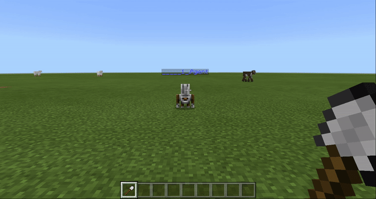
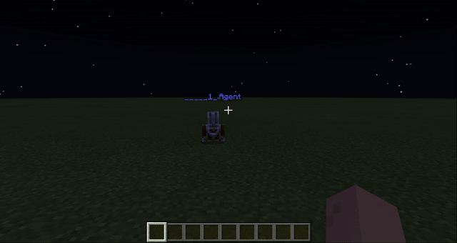
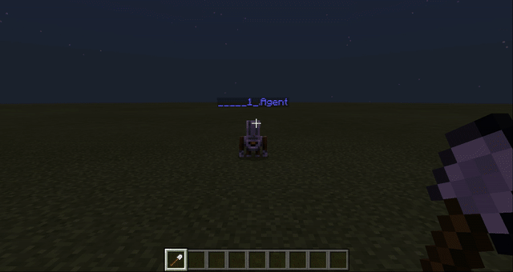

# Урок 6. Ліхтарі вздовж дороги

## Строим фонарь.

Для начала - строим фонарь вручную для того, чтобы студенты увидели структур будущей конструкции. Для этого - возьмем в инвентаре забор и светокамень. Выберите один из заборов:  

Например, возьмите забор из дуба:  

Выберите место, в котором будем строить:  

Построим фонарь \(ножка высотой 4, перекладина — 2\) 

Берем светокамень в инвентарь. 

Подвешиваем светокамень на край перекладины  

Программируем фонарь с помощью кода: 

Программируем фонарь с помощью кода:  

Добавляем переход между фонарями:  

Последовательно - напишите команды light, transitions, light.

Напишите программу, которая объединяет постройку фонаря \(light\) и переход \(transition\). При этом - добавьте возможность повторять создание словаря и переход несколько раз так, чтобы параметр передавался непосредственно в команде.

Запустите команду lights с параметром 5 \(`lights 5`\), чтобы было создано 5 фонарей

[Ссылка на код](https://makecode.com/_RDiX3z1oRfc5)

