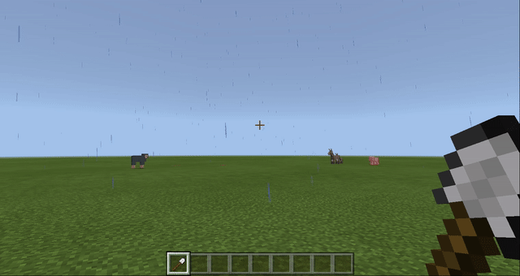

# Урок 7. Розмітка дороги

## Разметка дороги.

**Темы урока:** Цикл с праметром. Оператор выбора. Остаток от деления логический оператор

### Дорога (повторение)

Построим дорогу длиной 10 блоков и шириной 3 блока.&#x20;

.png>)

Для того, чтобы студенты разобрались с дорогой: задание сделать дорогу шириной 5.

.png>)

Заменим основной цикл на цикл с параметром.

.png>)

### Остаток от деления (со строками)

Добавим к циклу с параметром оператор выбора с использованием остатка от деления.

.png>)

.png>)

Запустим:

### Зебра

Для того, чтобы разобраться с использованием остатка от деления для формирования последовательности, создадим зебру - элемент пешеходного перехода. Для этого добавим в цикле с параметрами оператор выбора (блок с условием, истинной и ложной ветвью). А также - ставим в поле условия блок `0 = 0`.

.png>)

Вместо первого `0` вставим блок "Остаток от деления" (действие **1**) В блоке "Остаток от деления" в поле делимого будем использовать счетчик цикла (`index`) (действие **2**). В поле делителя вместо 1 укажем 2. (действие **3**)&#x20;

.png>)

Если условие выполняется (истинная ветвь) - делаем активной ячейку инвентаря №1, если не выполняется (ложная ветвь) - делаем активной ячейку инвентаря №2.&#x20;

.png>)

Запускаем написанный код.

.png>)

### Зебра - в начале дороги

Добавим условие, что зебра (последовательность белых и серых полос) — когда номер полосы меньше 6. Для этого - используем составное логическое выражение (используем оператор `и`)\

.png>)

Запустим данный код.

.png>)

### Дорога с разметкой.

Дорога с разметкой - это условия для первого цикла и для второго. Первый цикл - это последовательность, второй цикл - номер блока в линии дороги.\
Реализуем разметку через ввод двух условий (в первый и второй циклы).

.png>)

Получим итоговую разметку:

.png>)

Мы можем аналогично реализовать данный алгоритм, используя логический оператор `И`&#x20;

.png>)

[Ссылка на код](https://makecode.com/\_RXUVziMhwbYq)
