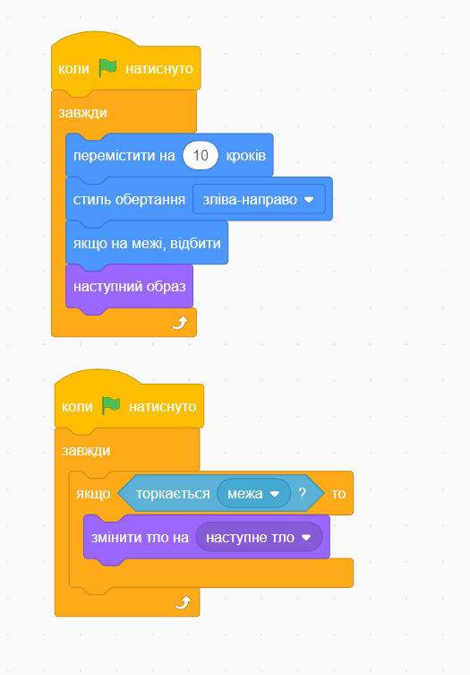

# Урок 1. Знайомство зі Scratch

### Мета заняття:

* Навчитися користуватися з програмою
* Вивчити базові команди
* Навчитись працюват з фоном та рухами

### Презентація для заняття:



### **Знайомство \(10хв\)**

Говоримо про себе \(викладач\). Важливо назватися, нагадати назву організації, курсу, назву групи, час та день зустрічей.

Просимо за порядком назвати свої ім’я, скільки років, з якого міста приєдналися.

### Знайомство зі Scratch \(20 хв\)

1. Показуємо як реєструватись в програмі і створювати свій профіль.
2. Як створити проект.
3. Що таке спрайт? і як його свторити у програмі.
4. Вчимося домальовувати персонажа
5. Додаємо власного персонажа \(не з бібліотеки\)

### Створення і заміна фону \(15 хв\)

Показуємо дітям, як в програмі додається фон \(тло\). І як за допомогою коду можна змінити фон на інший.

[**Посилання на код:**](https://scratch.mit.edu/projects/534296976)\*\*\*\*



### Діалог персонажів \(15 хв\)

Створюємо з дітьми фон \(тло\) і два спрайта \(персонажа\). Окремо для кожного пресонажа за допомогою коду прописуємо репліки. 

