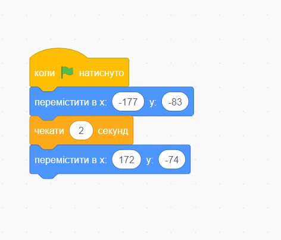
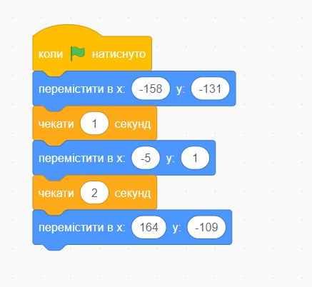

# Урок 2. Переміщення предметів

### **Мета заняття:**

* закріпити знання попередньої теми
* навчитись переміщувати предмети та персонажів різними способами

### **Презентація для заняття:**



### **Перевірка домашнього завдання \(15 хв\)**

### Керування персонажем \(15 хв\)

Розказуємо дітям, які категорії команд існують у програмі Scrtach. Пояснюємо поняття "скрипт" і як він будується.

Практикуємо написання скрипта з блоками **категорії "Рух"** \(змінюємо кількість кроків персонажа і кут руху\)

Додаємо візуальне оформлення за допомогою коду з **категорії "Вигляд"**. Змінюємо образ, розмір, додаємо спец.ефекти.

У **категорії "Керування"** знайомимось з командою "чекати \_\_ секунд", щоб робити паузи в програмі. А також вчимось повторювати алгоритм дій за допомогою команди "завжди"

### Створюємо гру "Футбол" \(20 хв\)

Створюємо 3 спрайта - гравця, вороторя і м'яч. Підбираємо фон \(тло\) з футбольним полем і для кожного персонажа прописуємо свій код.

\*\*\*\*[**Посилання на код**](https://scratch.mit.edu/projects/504886795)\*\*\*\*



### Створюємо гру "Баскетбол" \(20 хв\)

###  **Кахут \(15 хв\)**



\*\*\*\*

