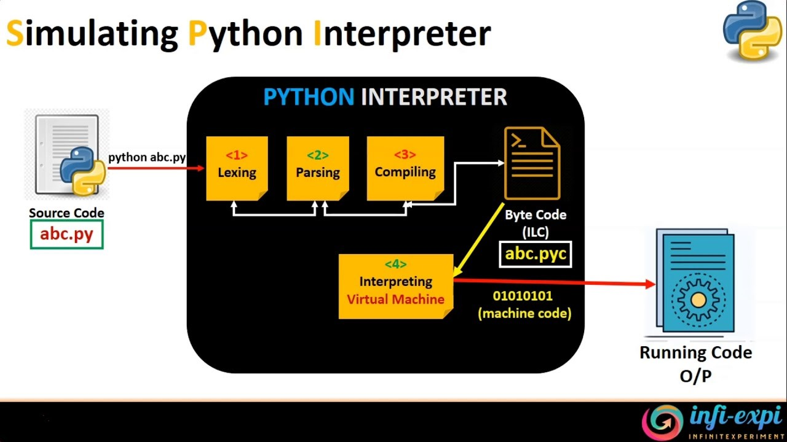

# Вступ. Що таке Python?

### **Мета** заняття:

Отримати загальну інформацію стосовно мови програмування Python, області її застосування, програмних засобів для написання та запуску програм.

### Актуалізація опорних знань

1. Уточнити рівень володіння учнів навичками програмуванням, знання елементарних конструкцій, мов програмування.
2. Зазначити, що курс базовий і читається з «нуля». Ніяких попередніх знань з області програмування не потрібно.&#x20;

### Основні питання, що будуть розглянуті

1. Поняття змінних
2. Типи даних
3. Правила оголошення змінних
4. Формування виразів та інструкцій.

### **Визначення**

_Python is a widely used high-level, general-purpose, interpreted, dynamic programming language. Its design philosophy emphasizes code readability, and its syntax allows programmers to express concepts in fewer lines of code than possible in languages such as C++ or Java._

### **Високорівнева мова (high-level)**

**Исходный код (source code)** — это набор фраз, слов и специальных символов, специфичных для языка программирования, описывающих набор инструкций для компьютера.

Но символы, слова и фразы, которые составляют программу, на самом деле непонятны для машины. Есть шаг, выполняющийся после написания программы, который конвертирует исходный код в файле в набор инструкций понятных компьютеру. Этим занимается специальная программа: **компилятор** или **интерпретатор**.




#### Блок-схема выполнения кода интерпретатором

Шаг 1: скрипт или .py-файл компилируется, и из него генерируются бинарные данные. Готовый файл имеет расширение .pyc или .pyo.

Шаг 2: генерируется бинарный файл. Он читается интерпретатором для выполнения инструкций.

### Python онлайн-компиляторы

Для проверки кода на Python подходит сервис [**Online Python**](https://www.online-python.com)****

Здесь представлена простая IDE, которая поддерживает загрузку с компьютера и скачивание кода в виде файла с расширением \*.py. Вы можете работать над проектом совместно с коллегами, поделившись ссылкой. В редакторе поддерживается тёмная тема.

В многоязычных компиляторах тоже очень хорошая поддержка Python.

Например, на [**Repl.it**](https://replit.com) есть вторая и третья версии языка,

* Python with Turtle для обучения
* фреймворк PyGame и движок Pyxel для создания игр
* библиотека Tkinter для разработки графического интерфейса
* шаблоны для Django, Multi-Page Flask и даже ботов для Discord.

_Джерело _[_https://tproger.ru/digest/compile-code-online/#part2_](https://tproger.ru/digest/compile-code-online/#part2)__

### **Практичне завдання**

Написати програму і пояснити всі інструкції в коді:

```
print("Hello world")
a = 5
b = 6
print('a+b =', a + b)
```

```
def sum(a, b):
    return (a + b)
a = int(input('Enter 1st number: '))
b = int(input('Enter 2nd number: '))
print(f'Sum of {a} and {b} is {sum(a, b)}')
```

### **Переваги мови**

* Python works on different platforms (Windows, Mac, Linux, Raspberry Pi, etc).
* Python has a simple syntax similar to the English language.
* Python has syntax that allows developers to write programs with fewer lines than some other programming languages.
* Python runs on an interpreter system, meaning that code can be executed as soon as it is written. This means that prototyping can be very quick.
* Python can be treated in a procedural way, an object-oriented way or a functional way.

Python supports multiple programming paradigms, including object-oriented, imperative and functional programming or procedural styles. It features a dynamic type system and automatic memory management and has a large and comprehensive standard library

### **Швидкість виконання коду Python**

Один з можливих недоліків Python - швидкість виконання коду.

Python не є компільованою мовою. Код на Python спочатку компілюється у внутрішній байт-код, який потім виконується інтерпретатором Python. У більшості випадків при використанні Python виходять програми повільніші в порівнянні з такими мовами, як C.

Втім, сучасні комп’ютери мають таку обчислювальну потужність, що для більшості застосунків швидкість розробки важливіша швидкості виконання, а програми на Python зазвичай пишуться набагато швидше.

Окрім того, Python легко розширюється модулями, написаними на C або C++.

Такі модулі можуть використовуватися для виконання частин програми, що створюють інтенсивне навантаження на процесор.

### Завантаження Python на локальний ПК

Версії інтерпретатора `Python` для різних операційних систем доступні для безкоштовного завантаження за адресою  [https://www.python.org/downloads](https://goo.gl/RZEX7A) .

**Python Ecosystem**

Тут написати якийсь текст, що сучасне ПЗ базується на залежностях, і у власну програму можна завантажити сторонній модуль (бібліотеку) для виконання якогось завдання

[https://realpython.com/python-modules-packages/](https://realpython.com/python-modules-packages/)

**Бібліотеки**

**Фреймфорки**

Програмний фреймворк ([англ.](https://uk.wikipedia.org/wiki/%D0%90%D0%BD%D0%B3%D0%BB%D1%96%D0%B9%D1%81%D1%8C%D0%BA%D0%B0\_%D0%BC%D0%BE%D0%B2%D0%B0) software framework) — це готовий до використання комплекс програмних рішень, включаючи дизайн, логіку та базову функціональність системи або підсистеми.

Відповідно — програмний фреймворк може містити в собі також допоміжні програми, деякі бібліотеки коду, скрипти та загалом все, що полегшує створення та поєднання різних компонентів великого програмного забезпечення чи швидке створення готового і не обов'язково об'ємного програмного продукту.

[https://www.netsolutions.com/insights/top-10-python-frameworks-for-web-development-in-2019](https://www.netsolutions.com/insights/top-10-python-frameworks-for-web-development-in-2019)

**Встановлення залежностей**

The Python Package Index (PyPI) is a repository of software for the Python programming language.

PyPI helps you find and install software developed and shared by the Python community.

C:\\> py -m pip install SomePackage

**IDE**

### Что такое IDE и редактор кода?

IDE (или интегрированная среда разработки) — это программа, предназначенная для разработки программного обеспечения. Как следует из названия, IDE объединяет несколько инструментов, специально предназначенных для разработки. Эти инструменты обычно включают редактор, предназначенный для работы с кодом (например, подсветка синтаксиса и автодополнение); инструменты сборки, выполнения и отладки; и определённую форму системы управления версиями.

[https://tproger.ru/translations/python-ide/](https://tproger.ru/translations/python-ide/)

### **Домашня робота**&#x20;

Поставити на ПК відповідну версію Python і виконати код програм з пункту 1

### **Контрольні питання**

1. Переваги мови програмування Python
2. Область використання
3. Виконання Python - програм
4. Ядро, модулі, бібліотеки, фреймворки
5. Інсталяція Python на локальний ПК
