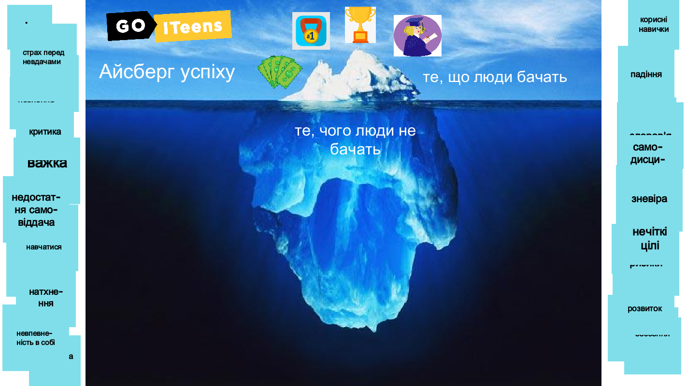

# Урок 2. Світ професій

## Мета заняття:

## **Презентація для заняття:**



## **Слово викладача \(5 хв\)**

Питаємо в дітей про їхні справи, як пройшов тиждень і що на занятті дізнаємось про професії, і які навички потрібно розвивати, щоб досягти успіху.

## **Айсберг успіху \(15 хв\)**

Після 4 слайду презентації \(що потрібно людині аби досягти класних результатів в професії\) робимо практичне завдання - з чого складається успіх?

Зображення айсбергу, зверху - символи успіху, знизу діти мають самі поставити відповідні елементи. Є ті, з чого складається успіх, а є такі, які навпаки заважають успіху - їх діти мають залишити на полях.

Вправа розвиває: мислення, командну гру, комунікацію, навички гри за правилами.




Важливо! Робимо або копію оригіналу Jamboard або скачуєте на комп’ютер! І саме копію даємо дітям на опрацювання!


## **Якість-навичка \(15 хв\)**

Після 8 слайду презентації _\*\*_для перевірки розуміння дітей різниці між особистими якостями і навичками пропонуємо вправу. В першому стовпчику діти мають вписати свої 2 особисті позитивні якості. В другому стовпчику - свої 2 навички. Порядок не має значення, підписувати не треба.

Узагальнення: викладач зачитує і разом розбирають чи правильно записані у відповідні стовпчики.



## **Професії \(15 хв\)**

Слайд 14-17 розбираємо разом з дітьми, які навички hard і soft потрібні для конкретної професії: лікар, будівельник, вчитель, програміст.

## **Minecraft-професії \(5 хв\)**

Просимо дітей назвати професії, які залучені у будування світів у грі Minecraft \(фінальний слайд\)

