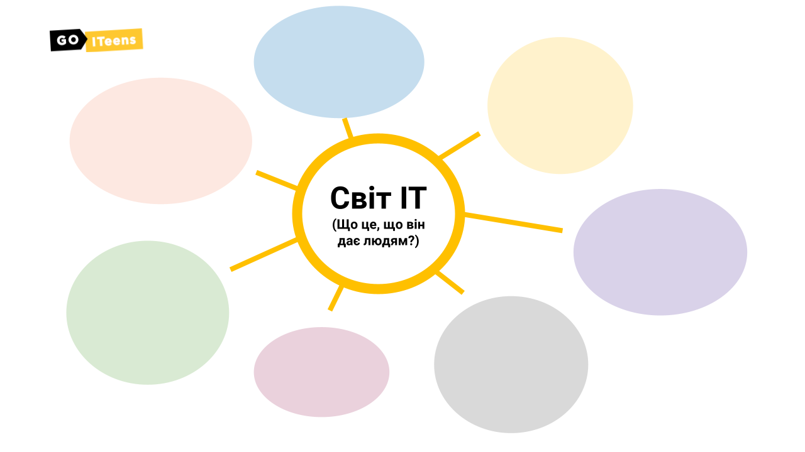
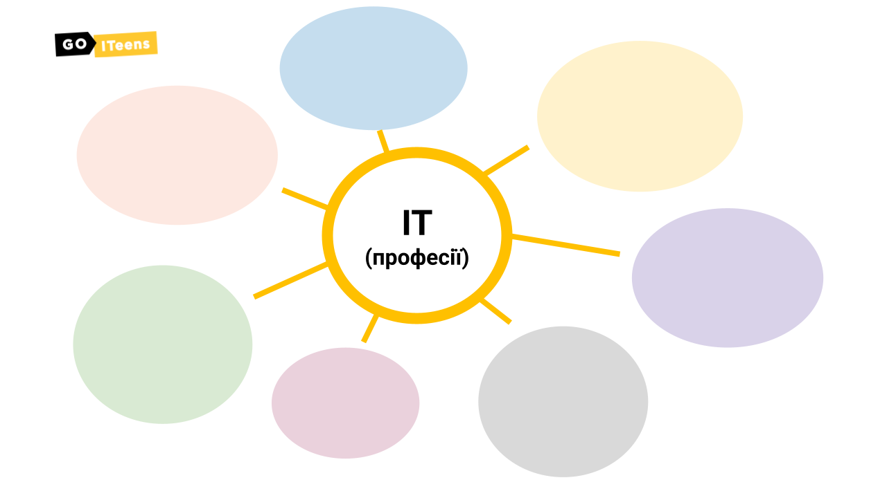

# Урок 3. Світ IT

## Мета заняття:

### **Презентація для заняття:**



### **Слово викладача \(5 хв\)**

‌Питаємо в дітей про їхні справи, як пройшов тиждень ~~_і що на занятті дізнаємось про професії, і які навички потрібно розвивати, щоб досягти успіху._~~

### **Світ IT. Що це, що він дає людям? \(5 хв\)**

Розмірковуємо разом з дітьми про те, які можливості відкривають інформаційні технології перед людьми.

### **Професії в IT \(15 хв\)**

Питаємо в дітей, які IT-професії їм відомі і поступово складаємо список

