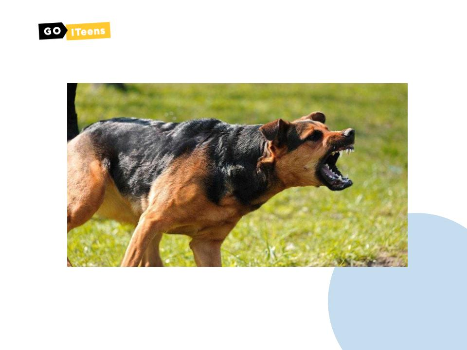

# Урок 4. Емоційний інтелект

### Мета заняття:

### **Презентація для заняття:**


Урок 4. Емоційний інтелект


### Привітання (5 хв)

Вітаємося з учнями. Запитуємо як у них справи / як настрій / як пройшов тиждень. Встановлюємо контакт.

### **Що таке емоції? (5 хв)**

Дивимося прямо в камеру, “обличчя - бетон”. Не проявляємо жодної реакція, емоції. Даємо завдання дітям покривлятися, щоб розсмішити вас (нехай трішки гримаси роблять, вони це люблять). Реагуємо усмішкою, далі сміхом. Запитуємо в дітей, що тепер вони бачили? акцентуємо увагу, що вони побачили реакцію, яку? - сміх. На що або чому? - на гримаси. Тобто емоція - це реакція на певну подію, якою ми виражаємо своє ставлення до події.

### **Що ти відчуваєш? (15 хв)**

Дивлячись на фотографії** **на слайдах, ми питаємо у дітей, які емоції вони відчувають, коли бачать те що там зображено. Основний посил,що кожен з нас на одну і ту ж саму ситуацію може реагувати по різному.

### Що таке емоційний інтелект? (15 хв)

Дитина гуляє в парку і бачить, що на зустріч їй вибігає собака. Показуємо картинку злої собаки. Питаємо, що діти думають про неї? чому вони так вирішили? Що потрібно зробити? Відповідь: собака зла, тому що (називаємо всі явні ознаки). Далі обговорюємо правила поведінки в такій ситуації - не робити різких рухів, не дивитися в очі, спокійно малими кроками йти назад, при можливості покликати на допомогу.&#x20;

Після цього визначаємо, де спрацював наш емоційний інтелект, а де розумовий. Чи можна було без чогось обійтися?Розмовляємо про те що таке IQ та EQ.

### **Вгадай емодзі (15 хв)**

Емодзі в листуванні?! Для чого ми їх використовуємо і як вони впливають на зміст нашого повідомлення? \
На слайді зображені японські емоджі - прабатьки для сучасних емодзі. Вгадуємо що означає кожен з цих малюнків.\

### **Домашнє завдання:**

Зробити фотоколаж зі своїх фотографій (нових або вже наявних) з різними емоціями: 1. Щастя 2. Смуток 3. Страх 4. Відраза 5. Злість 6. Подив\
