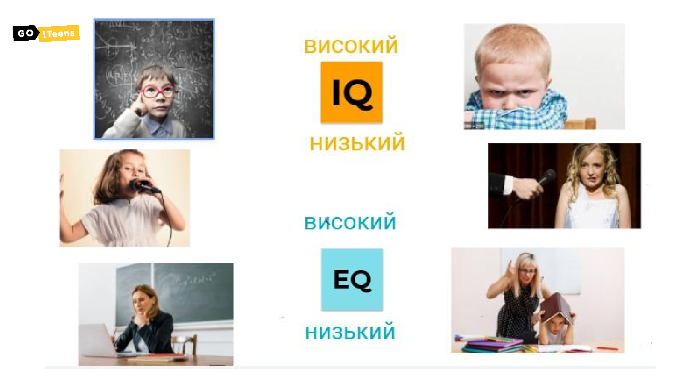
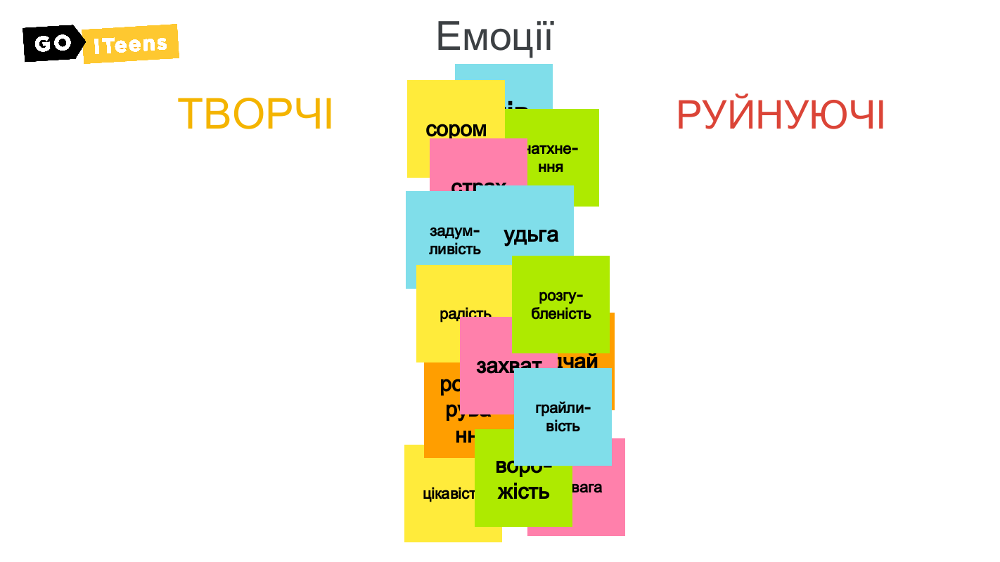
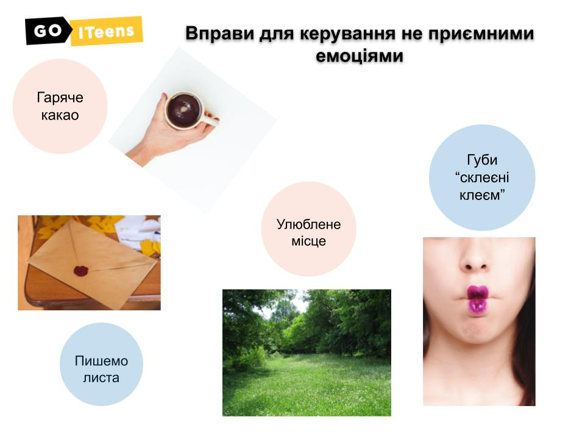

# Урок 5. Емоційний інтелект \(продовження\)

### Мета заняття:

### **Презентація для заняття:**



### Привітання **і перевірка завдання** \(10 хв\)

Вітаємося з учнями. Запитуємо як у них справи / як настрій / як пройшов тиждень. Встановлюємо контакт. ****Перевіряємо домашнє завдання.

### EQ vs IQ \(10 хв\)

Для чого нам потрібен емоційний інтелект, чим він нам може бути корисним у нашому житті: 

Приводимо приклад : 

1. Уявіть собі людину \(хлопця/або дівчину\), яка дуже кмітлива, дуже розумна. Але коли в неї щось не виходить, вона дуже сильно засмучується і кілька днів дуже погано себе почуває.

2. Ще наприклад, дівчинка/або хлопець дуже гарно грає у виставі і на репетиціях все дуже добре вдається. Але коли потрібно виходити на сцену страх так сильно володіє ,що він/вона просто забуває текст і не може грати.

3. І третій варіант - уявіть собі вчителя, який гарно знає свій предмет, але дуже сварить своїх учнів, не має терпіння якщо вони щось забули. 



За допомогою інструмента “ручка” з’єднуємо картинки зі словами “низький” - “високий” на Дошка 1. Визначаємо з дітьми, що об’єднує цих героїв. Що у всіх них високий IQ та низький EQ.

### **Емоції - творчі і руйнуючі \(15 хв\)**

На дошці 2 є перелік емоцій. Даємо дітям доступ до дошки і командне завдання розподілити, які емоції вони ставлять до творчих, а які до руйнуючих. Згодом перевіряємо і обговорюємо.

Можливість подумати всім учасникам одночасно, порухатися, пограти в команді.



### **Управління емоціями \(15 хв\)**

Для того щоб нам навчитись керувати емоціями, нам потрібно розглянути таку формулу. ****Результат= Ситуация+ ставлення до неї. Ми не все можемо змінити, але своє ставлення можемо і це нам допоможе по життю бути більш щасливим. Навести якісь приклади окрім того що є в презентації. Як можна змінивши своє ставлення до ситуації отримати інший результат. У презентації простий приклад з дощем: можна гарно одягнутися і насолодитися, а можна плакати і бути у поганому настрої.

**1. Гаряче какао або пиріжок -** вправа на втамування злості - дихальна вправа, візуалізація. Увляємо, що в руках чашка з дуже гарячим какао. Нам його важко втримати в руках. Ми то однією то другою рукою торкаємося, але дуже пече. Потрібно охолодити за допомогою повітря. Вдихаємо носом під рахунок 1, 2, 3, 4. Повільно видихаємо ротом під рахунок 1, 2, 3, 4, 5, 6. Так робимо три рази. Відчуваємо, що какао стає все холоднішим і холоднішим допоки не стане приємно теплим, випиваємо. Можна повторити ще раз.

**2. “Губи склеєні клеєм” -** коли ми дуже злі, ми можемо наговорити багато зайвого, про що будемо дуже шкодувати в майбутньому. Саме для цього ця вправа. Як відчуваєте, що емоції зашкалюють, уявіть що ваші губи склеєні - просимо дітей спробувати міцно стиснути губи, порахувати до 10, глибоко вдихнути і видихнути. Заспокоїлися? - можна говорити.

**3. Написати лист людині, що вас дуже розізлила, але не надсилати його.** Просто порвати і викинути в смітник. Після такої вправи стає значно легше і емоції стихають.4.  Місце де тобі найбезпечніше - улюблене місце. - якщо дуже страшно чи сумно або забагато неприємних емоцій, допомагає розслабитися вправа, при якій потрібно згадати і уявити, що ти перебуваєш в тому місці, яке для тебе є найбезпечніше, найзручніше, найулюбленіше. Просимо дітей за порядком поділитися своїми місцями затишку.

### **Домашнє завдання:**

Щоденник емоцій: будь уважним до себе, записуй кожного дня які емоції ти відчув и що було причиною їх появи.



\*\*\*\*

