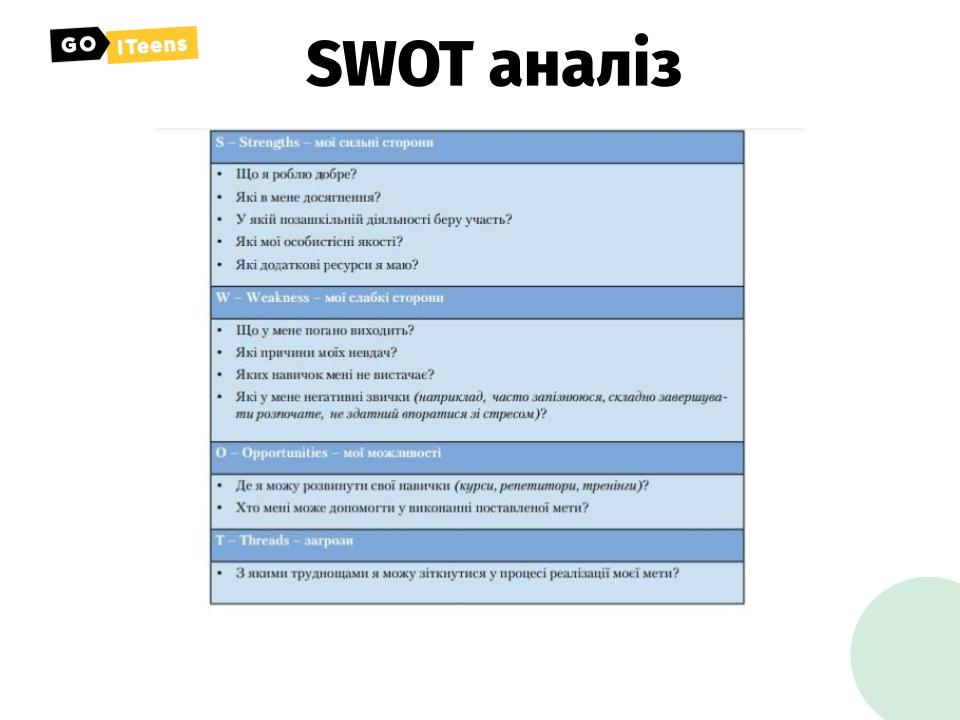

# Урок 8. Самостійність \(продовження\)

### Мета заняття:

### **Презентація для заняття:**



### Привітання **і перевірка завдання** \(10 хв\)

Вітаємося з учнями. Запитуємо як у них справи / як настрій / як пройшов тиждень. Встановлюємо контакт. ****Перевіряємо домашнє завдання.

### **Конкретизація мрії, практикуємо**

До четвертого слайду презентації невеличка вправа для набуття навички конкретизації мрії.

### **Гра “Загадай бажання золотій рибці”**

Наводимо приклади мрій. Пропонуємо дітям придумати їй конкретизацію- Загадати бажання Золотій рибці. ****Наприклад: 

1. Переїхати в Америку.

Конкретизація - жити в Флориді \(уточнення назви\), купити будинок \(щоб жити потрібне постійне місце\), працювати програмістом в … компанії \(щоб жити потрібно мати гроші на прожиття\), отримати американську візу на 10 років., інші варіанти.

2. Стати успішним в програмуванні.

Конкретизація - стати Senіor розробником, реалізувати 5 проектів за рік, працювати в …. компанії, вільно розмовляти англійською, підписати 7 контрактів на співпрацю за 2 роки, створити власну команду, свої варіанти.

Всі конкретизації можна в реальному часі обговорювати командою учасників і записувати на дошці їхні варіанти.

Так як більшість з них про це і мріє, будуть мати готові варіанти:\)

### **“Шлях до мети”**

- терапевтична вправа, яка виховує волю до перемоги, віру в успіх.

Є три варіанти її виконання, беручи до уваги онлайн навчання.

* Можна попросити, щоб діти заздалегідь підготували аркуш паперу і олівець і малювали все в реальному часі. Зауважте, що вам потрібно буде мінімум 20 хв на її виконання.
* Скористатися Jamboard google, попередньо намалювати героя та стежку і підготувати перешкоди. Кожен учасник за порядком вибирає перешкоду і ставить на відрізок шляху. В кінці обговорюємо шляха подолання перешкод. Час - 10 хв.
* Якщо учасників в групі багато. Тоді самі робимо заготовку - картинку з шляхом і вже готовими перешкодами. З учасниками обговорюємо лиш шляхи їх подолання.

Завдання: намалювати шлях до мети свого героя з безліччю перешкод. У героя обов’язково має бути мета заради якої він здолає всі труднощі \(друг, скарб, кубок першості, реалізований проект і т.д\). Шлях героя пролягає через весь лист. Чим більше перешкод, тим краще. Коли малюнок закінчений, обговорюємо способи долання перешкод. Важливо щоб дитина їх долала сама \(стрибала, перепливала, билася і т.д\), а не користувалася такими способами як чарівна паличка, плащ-невидимка чи інше. Чим більше способів подолання перешкод, тим краще. Варіанти можуть пропонувати всі учасники. 

**Важливо! Робимо або копію оригіналу або скачуєте на комп’ютер! І саме копію даємо дітям на опрацювання!**



### **Відео про досягнення мети**

Додатково, можна після вправи запропонувати діткам переглянути відео про свинку у якої на шляху було безліч перешкод для досягнення своєї мети. Але вона жодного разу не здавалася ****:\)



### **Візуалізація SWOT аналіз**

До 13 слайду детальна візуалізація аналізу. Можна надіслати в кінці презентації учасникам.

### **Домашнє завдання:**

1. Вибираємо 3 бажання зі списку, конкретизуємо їх і пише to-do list для цієї мети. \(Що необхідно зробити, щоб її досягти\).
2. Мої пожирачі часу - напишіть, що заважає вам бути ефективним.

